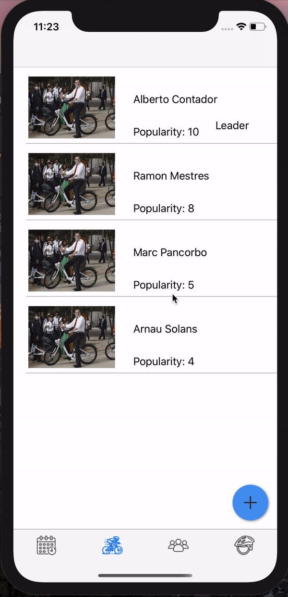

# CYCLISME APP
## Authors
- [Marc Pancorbo](https://github.com/marcpancorbo)
- [Arnau Solans](https://github.com/asolans1999)

## Setup
Necesitarás aplicar el siguiente comando por consola para poder instalar los pods utilizados:
```
pod install
```
## Model 
El modelo de la aplicación presenta las siguientes clases: 
- [Cyclist](https://github.com/marcpancorbo/ProyectoSwift/blob/master/Proyecto/model/Cyclist.swift)

- [Race](https://github.com/marcpancorbo/ProyectoSwift/blob/master/Proyecto/model/Race.swift)

- [Team](https://github.com/marcpancorbo/ProyectoSwift/blob/master/Proyecto/model/Team.swift)

- [User](https://github.com/marcpancorbo/ProyectoSwift/blob/master/Proyecto/model/User.swift)

## Description

Esta aplicación va destinada a amantes del ciclismo con ganas de tener al alcance de su mano todos los datos relevantes sobre este deporte. 

Al iniciar la aplicación deberas iniciar sesión via Google y una vez registrado se mostrará una TabBar que da acceso a distintas tablas donde se presentan carreras, equipos y ciclistas; si quieres saber más información sobre cada uno de los elementos podrás hacer click sobre el item para abrir una vista con los detalles de este.

En la parte inferior dispondrás de un menú con los siguientes apartados: Carreras, Ciclistas, Equipos y Perfil(Esta view solo está implementada en el menu); como hemos comentado al principio por defecto estará la de carreras.

Cuando vayas a la vista de ciclistas se te mostrará una tabla con los ciclistas, de cada uno con su foto, nombre y apellido, popularidad y te mostrará si es lider, todos ellos ordenados por dicha popularidad. En la esquina inferior derecha tendremos un floating button, al hacer click nos desplegara una opcion que nos permitirá añadir un ciclista nuevo. Para añadir uno nuevo debemos rellenar la información y darle al botón de guardar.

Para ver la información de un ciclista en concreto tendremos que pulsar en la tabla su casilla y nos dirigirá a una vista con toda su información detallada. En esta vista tendremos un boton para poder editar dicho ciclista.

### Delete Cyclist
Para eliminar un ciclista desde la vista de la tabla arrastraremos la fila con el ciclista hacia la izquierda:



Por último tendremos la vista de los equipos que nos mostrará el nombre del equipo y una foto.

## Realm

Para está aplicación hemos utilizado Realm como método de almacenamiento de datos a nivel de dispositivo.  
Tenemos un clase [Manager](https://github.com/marcpancorbo/ProyectoSwift/blob/master/Proyecto/controller/BBDDManager.swift) donde creamos las tablas, inicializamos la información y la guardamos, además de todos los métodos CRUD básicos como inserts, selects, y deletes entre otros.

## Google Login

Para el login hemos usado un pod de google, que nos permite iniciar sesión con una cuenta de correo Google, el inició de sesión se quedará almacenado
para no tener que iniciar sesión cada vez que abras la aplicación

## Pods 

Para la práctica hemos utilizado los siguientes pods:
- [Floaty: Floating Action Button](https://github.com/kciter/Floaty)
- [Realm](https://github.com/realm/realm-cocoa)
- [Google Sign In](https://developers.google.com/identity/sign-in/ios/start)
