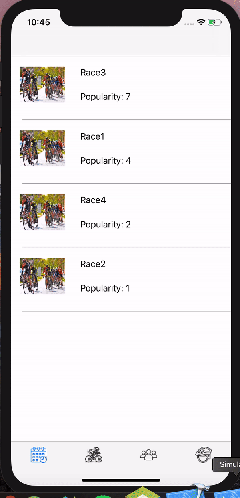
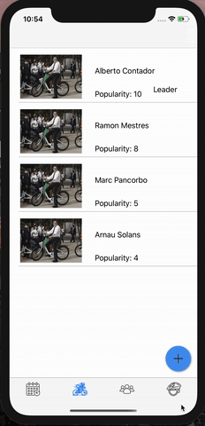
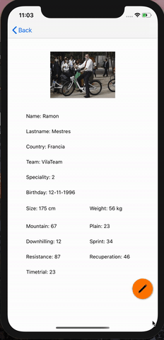

# CYCLISME APP
## Authors
- [Marc Pancorbo](https://github.com/marcpancorbo)
- [Arnau Solans](https://github.com/asolans1999)

## Table of Contents  
- [Setup](##Setup)
- [Model](##Model)
- [Description](##Description)
- [Navigation](###Navigation)
## Setup
You will need to apply the following command to be able to install the used Pods:
```
pod install
```
## Model 
The application model presents the following classes: 
- [Cyclist](https://github.com/marcpancorbo/ProyectoSwift/blob/master/Proyecto/model/Cyclist.swift)

- [Race](https://github.com/marcpancorbo/ProyectoSwift/blob/master/Proyecto/model/Race.swift)

- [Team](https://github.com/marcpancorbo/ProyectoSwift/blob/master/Proyecto/model/Team.swift)

- [User](https://github.com/marcpancorbo/ProyectoSwift/blob/master/Proyecto/model/User.swift)

## Description

This application is intended for cycling enthusiasts wanting to have at their fingertips all the relevant data about this sport. 

When starting the application you'll need to log in via Google and then you'll be able to see a TabBar that gives you access to different tables where races, teams and cyclists are presented; If you want to know more information about each of the elements you can click on the item to open a view with the details of it.

### Navigation

At the bottom you will have a menu with the following sections: Racing, Cyclists, Equipment and Profile (This view is only implemented in the menu); As we mentioned at the beginning by default the view will be the racing one.




When you go to the view of cyclists you will be shown a table with the cyclists sorted by said popularity, each with their photo, name and surname, popularity and will show you if it is a category leader. 


### Create Cyclist

In the lower right corner you will have a floating button, clicking on it will display an option that will allow you to add a new cyclist. To add a new one you must fill in the information and click on the save button. 



### Edit Cyclist

To see the information of a specific cyclist we will have to click on the box and it will direct us to a view with all its detailed information. In this view we will have a button to edit this cyclist.




### Delete Cyclist
To delete a cyclist from the table view we will drag the row with the cyclist to the left: 


## Realm

For this application we have used Realm as a method of data storage. 
We have a class [Manager](https://github.com/marcpancorbo/ProyectoSwift/blob/master/Proyecto/controller/BBDDManager.swift) where we create the tables, initialize the information and save it, in addition to all the basic CRUD methods such as inserts, selects, and deletes among others.

## Google Login

To Log in he have used the Google's one, which allows us to log in with a Google email account and remember it so we don't have to enter it again.

## Pods 

For the application we have used the following pods:
- [Floaty: Floating Action Button](https://github.com/kciter/Floaty)
- [Realm](https://github.com/realm/realm-cocoa)
- [Google Sign In](https://developers.google.com/identity/sign-in/ios/start)
